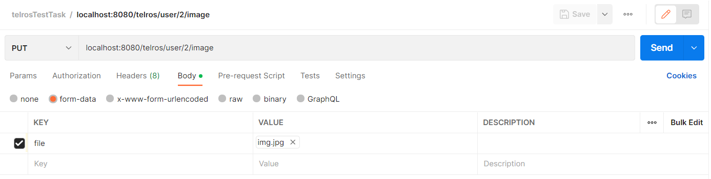

# Course work (in progress)
Test task for [telros](https://www.telros.ru/) company

##  🚀 Getting Started
This section provides a high-level quick start guide

### Prerequisites
- [Java](https://www.oracle.com/java/technologies/) 11
- [Maven](https://maven.apache.org/) 3.8.6
- [PostgreSQL](https://www.postgresql.org/) 11 or higher
- [IntelliJ IDEA](https://www.jetbrains.com/ru-ru/idea/)

**Step 1. Set up environment variables**
- ```POSTGRES_USER```  = postgres user
- ```POSTGRES_PASS```  = postgres password

**Step 2. Configure DB**

Create DB ```telrosTestDB``` with 5432 port on your local machine

**Step 3. Build app**

>mvn clean install

**Step 4. Run**

_Idea_:
- create SpringBoot configuration
- set up environment variables to configuration
- run

### Examples
You can find example-request in directory ```request```.
You can test this requests in Intellij Idea (Ultimate Edition) or copy them into postman.
For putting image you can use the image in resources/image directory.
Screenshot from postman with such request:

